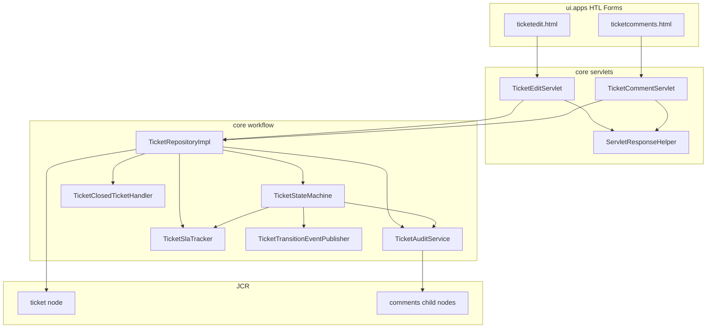
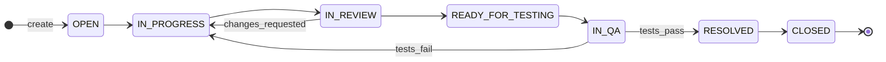
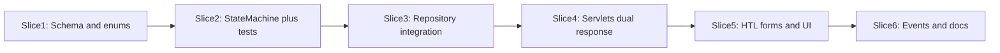

# Ticket Workflow State Machine Implementation Plan

## Current State (baseline)

The project already has a clean vertical slice:

- **Data:** JCR tickets at `/content/stms/tickets` with 4 statuses (`open`, `in-progress`, `resolved`, `closed`) — see [`TicketStatus.java`](core/src/main/java/com/ttn/stms/core/tickets/enums/TicketStatus.java)
- **Writes:** [`TicketRepositoryImpl`](core/src/main/java/com/ttn/stms/core/tickets/services/impl/TicketRepositoryImpl.java) with no transition rules; `updateTicket()` blindly sets `status`
- **API:** Form POST servlets ([`TicketEditServlet`](core/src/main/java/com/ttn/stms/core/tickets/servlets/TicketEditServlet.java), [`TicketCommentServlet`](core/src/main/java/com/ttn/stms/core/tickets/servlets/TicketCommentServlet.java)) → 302 redirect
- **Comments:** Flat nodes with `author`, `text`, `createdDate` only — [`TicketCommentModel`](core/src/main/java/com/ttn/stms/core/tickets/models/TicketCommentModel.java)
- **Listeners:** Archetype demo [`SimpleResourceListener`](core/src/main/java/com/ttn/stms/core/listeners/SimpleResourceListener.java) (not suitable for transactional workflow)

**Gap:** No state machine, no guardrails, no audit trail, no SLA tracking, no closed-ticket follow-up logic.

---

## Target Architecture



**Design principle:** Keep all workflow logic **synchronous inside `TicketRepositoryImpl`** (single JCR commit). Use OSGi Event Admin only for **async side-effects** (CSAT payload) after successful commit—not `ResourceChangeListener` (avoids race conditions and duplicate events).

---

## 1. Data Model & Schema Updates

### 1a. Expand `TicketStatus` enum

Add three new values to [`TicketStatus.java`](core/src/main/java/com/ttn/stms/core/tickets/enums/TicketStatus.java):

| Enum | JCR value |
|---|---|
| `IN_REVIEW` | `in-review` |
| `READY_FOR_TESTING` | `ready-for-testing` |
| `IN_QA` | `in-qa` |

Update labels, badge classes in [`TicketModel`](core/src/main/java/com/ttn/stms/core/tickets/models/TicketModel.java), list filters, and sample content in [`ui.content/.../tickets/.content.xml`](ui.content/src/main/content/jcr_root/content/stms/tickets/.content.xml).

### 1b. New enums

| Class | Purpose |
|---|---|
| `RootCauseCategory` | `configuration`, `code-defect`, `data-issue`, `third-party`, `user-error`, `other` |
| `CommentType` | `user`, `audit`, `qa-rejection` (stored as `commentType` on comment nodes) |

### 1c. Ticket node — new JCR properties

| Property | Type | Purpose |
|---|---|---|
| `pullRequestUrl` | String | Required for `IN_PROGRESS → IN_REVIEW` |
| `technicalSummary` | String | Alternative to PR URL for same transition |
| `resolutionSummary` | String | Required for `IN_QA → RESOLVED` |
| `rootCauseCategory` | String | Required for `IN_QA → RESOLVED` |
| `closedAt` | Date | Set on transition to `CLOSED` |
| `parentTicketId` | String | Set on follow-up tickets spawned from closed parents |
| `statusEnteredAt` | Date | Updated on every status change |
| `slaPaused` | Boolean | `true` when in `IN_REVIEW`, `READY_FOR_TESTING`, `IN_QA` |
| `slaPausedAt` | Date | Timestamp when SLA clock paused |
| `slaTotalPausedMs` | Long | Accumulated paused duration |
| `statusDurationsJson` | String | JSON map of `{status: millis}` updated on each transition |

### 1d. Comment node — new JCR properties

| Property | Type | Default |
|---|---|---|
| `commentType` | String | `user` |
| `isInternal` | Boolean | `true` during workflow stages (see guardrails) |
| `isQaRejection` | Boolean | `false` |
| `isSystemAudit` | Boolean | `true` for auto-generated transition logs |

Audit entries reuse the existing `comments/` container with `commentType=audit`, `isSystemAudit=true`, `author=system`.

### 1e. DTO updates

Extend [`TicketUpdateRequest`](core/src/main/java/com/ttn/stms/core/tickets/services/TicketUpdateRequest.java):

```java
// new fields
private String actorUserId;
private String pullRequestUrl;
private String technicalSummary;
private String resolutionSummary;
private String rootCauseCategory;
private String transitionCommentText;   // inline comment for QA rejection
private boolean transitionCommentIsQaRejection;
private boolean commentIsInternal;
private String responseFormat;          // "json" for API clients
```

Extend [`TicketCommentCreateRequest`](core/src/main/java/com/ttn/stms/core/tickets/services/TicketCommentCreateRequest.java) with `isInternal`, `isQaRejection`, `commentType`.

Add `TicketTransitionResult` (extends/wraps `TicketUpdateResult`) with `httpStatus`, `followUpTicketId` for closed-ticket edge case.

---

## 2. Centralized `TicketStateMachine` Service

**New package:** `com.ttn.stms.core.tickets.workflow`

### 2a. State transition graph



**Allowed transitions** (encoded as `Map<TicketStatus, Set<TicketStatus>>` in `TicketStateMachineImpl`):

| From | To |
|---|---|
| `OPEN` | `IN_PROGRESS` |
| `IN_PROGRESS` | `IN_REVIEW` |
| `IN_REVIEW` | `READY_FOR_TESTING`, `IN_PROGRESS` |
| `READY_FOR_TESTING` | `IN_QA` |
| `IN_QA` | `RESOLVED`, `IN_PROGRESS` |
| `RESOLVED` | `CLOSED` |

**Same-status updates** (title/description/priority/assignee only): always permitted unless ticket is `CLOSED` (handled by closed-ticket handler).

### 2b. Core classes

| Class | Responsibility |
|---|---|
| `TicketStateMachine` (interface) | `validateTransition(current, target, context)` → void or throw |
| `TicketStateMachineImpl` | Transition map + guardrail rules |
| `TicketTransitionContext` | Immutable bundle: current ticket, target status, request fields, actor |
| `InvalidTicketTransitionException` | Domain exception with message + error code |
| `TicketTransitionGuard` | Package-private rule objects per transition pair |

### 2c. Guardrail rules (in state machine)

| Transition | Guard |
|---|---|
| `IN_PROGRESS → IN_REVIEW` | `pullRequestUrl` OR `technicalSummary` non-blank |
| `IN_QA → IN_PROGRESS` | `transitionCommentText` non-blank AND `transitionCommentIsQaRejection=true` |
| `IN_QA → RESOLVED` | `resolutionSummary` AND `rootCauseCategory` (valid enum) non-blank |
| Any illegal pair | throw `InvalidTicketTransitionException` |

Error messages (aligned with [`api-contract.md`](api-contract.md) style):

- `"Invalid status transition from open to in-qa."`
- `"A pull request URL or technical summary is required to move to In Review."`
- `"A QA rejection comment with failure steps is required."`
- `"Resolution summary and root cause category are required to resolve."`

### 2d. Automatic side-effects (applied after validation, before commit)

| Transition | Side-effect |
|---|---|
| `* → IN_PROGRESS` | If `assignee` blank, set to `context.actorUserId` |
| `* → IN_QA` | Clear developer assignee; set assignee from OSGi config `qaPoolAssignee` |
| `* → CLOSED` | Set `closedAt`; publish CSAT event via `TicketTransitionEventPublisher` |
| Any status change | Update `statusEnteredAt`; call `TicketSlaTracker.recordTransition()`; write audit comment |

### 2e. OSGi configuration

New file in [`ui.config`](ui.config):

`com.ttn.stms.core.tickets.workflow.impl.TicketWorkflowConfig.cfg.json`

```json
{
  "qaPoolAssignee": "qa-pool@stms.local",
  "csatEnabled": true
}
```

---

## 3. Supporting Services

### 3a. `TicketAuditService`

- Method: `appendAuditComment(resolver, ticketId, from, to, actorUserId)`
- Writes system comment: `"Status changed from [In Progress] to [In Review] by [rahul.pandey@ttn.com]."`
- Sets `commentType=audit`, `isSystemAudit=true`, `isInternal=true`

### 3b. `TicketSlaTracker`

- On entering pause statuses (`IN_REVIEW`, `READY_FOR_TESTING`, `IN_QA`): set `slaPaused=true`, `slaPausedAt=now`
- On leaving pause statuses: add elapsed to `slaTotalPausedMs`, set `slaPaused=false`
- On every transition: accumulate time in previous status into `statusDurationsJson`

### 3c. `TicketClosedTicketHandler`

Invoked when `addComment()` or `updateTicket()` targets a `CLOSED` ticket:

- **Do not** change parent status
- Create child ticket via existing `createTicket()` with:
  - `parentTicketId` = closed ticket ID
  - `title` = `"Follow-up: {parent title}"`
  - `description` = includes reference + user input
  - `status` = `OPEN`
- Return `followUpTicketId` in result; servlet redirects to new ticket detail

### 3d. `TicketTransitionEventPublisher`

- Publishes OSGi `TicketTransitionEvent` on `CLOSED` transition
- Event properties: `ticketId`, `closedAt`, `assignee`, `createdBy` (CSAT payload scaffold)
- Listener: `TicketCsatEventListener` (logs event in MVP; hook for external integration later)

### 3e. Comment privacy defaults

In `TicketRepositoryImpl.addComment()`:

- If ticket status is in `{OPEN, IN_PROGRESS, IN_REVIEW, READY_FOR_TESTING, IN_QA}` and caller did not explicitly set `isInternal=false`, default `isInternal=true`
- Public comments require explicit `isInternal=false` form field

---

## 4. Repository Integration

Refactor [`TicketRepositoryImpl.updateTicket()`](core/src/main/java/com/ttn/stms/core/tickets/services/impl/TicketRepositoryImpl.java):

```
1. Load current ticket
2. If CLOSED → delegate to TicketClosedTicketHandler (no reopen)
3. If status unchanged → update metadata only (skip state machine)
4. If status changed:
   a. Build TicketTransitionContext
   b. ticketStateMachine.validateTransition(context)
   c. Apply side-effects (assignee, closedAt, SLA)
   d. Persist new properties
   e. If QA rejection inline comment → addComment() in same resolver (no nested commit)
   f. ticketAuditService.appendAuditComment()
5. resolver.commit() — single transaction
6. If CLOSED → publish CSAT event (post-commit)
```

Inject via `@Reference`: `TicketStateMachine`, `TicketAuditService`, `TicketSlaTracker`, `TicketClosedTicketHandler`, `TicketTransitionEventPublisher`.

Similarly guard `addComment()` for closed tickets → spawn follow-up instead of commenting on closed node.

---

## 5. Servlet & API Layer (dual-mode responses)

Per your choice: **redirect for HTL forms; HTTP 400 JSON for API clients**.

### 5a. New helper: `TicketServletResponseHelper`

```java
void respond(SlingHttpServletRequest req, SlingHttpServletResponse res,
             boolean success, String redirectUrl, String errorMessage, int errorStatus);
```

Logic:
- If `Accept: application/json` OR `responseFormat=json` → write JSON `{"success":false,"error":"..."}` with **HTTP 400** on validation failure
- Else → existing 302 redirect with `?error=` (preserve form values)

### 5b. Update [`TicketEditServlet`](core/src/main/java/com/ttn/stms/core/tickets/servlets/TicketEditServlet.java)

- Resolve `actorUserId` from session (same pattern as comment servlet)
- Map new form params: `pullRequestUrl`, `technicalSummary`, `resolutionSummary`, `rootCauseCategory`, `transitionCommentText`, `isQaRejection`
- Catch `InvalidTicketTransitionException` → 400 JSON or redirect

### 5c. Update [`TicketCommentServlet`](core/src/main/java/com/ttn/stms/core/tickets/servlets/TicketCommentServlet.java)

- Map `isInternal`, `isQaRejection` params
- Handle closed-ticket follow-up redirect to new ticket

### 5d. Optional dedicated transition servlet (phase 2, if edit form grows too complex)

`/bin/stms/ticket/transition` — status-only POST returning JSON. **Defer unless edit form conditional logic becomes unwieldy.**

---

## 6. Frontend Updates (`ui.apps`)

### 6a. [`ticketedit.html`](ui.apps/src/main/content/jcr_root/apps/stms/components/ticketedit/ticketedit.html)

- Status `<select>`: show only **allowed next statuses** from new `TicketEditModel.getAllowedTransitions()` (calls state machine read-only API)
- Conditional field groups (shown via HTL `data-sly-test` + small JS toggle):
  - PR URL + technical summary when target = `in-review`
  - Resolution summary + root cause dropdown when target = `resolved`
  - QA rejection comment textarea + checkbox when target = `in-progress` from `in-qa`
- Hidden `responseFormat` field for programmatic clients

### 6b. [`TicketEditModel`](core/src/main/java/com/ttn/stms/core/tickets/models/TicketEditModel.java)

- `@Reference TicketStateMachine` (via OSGiService)
- `getAllowedTransitions()` → list of `{value, label}` for current ticket status
- Expose new field values for repost/error recovery

### 6c. [`ticketcomments.html`](ui.apps/src/main/content/jcr_root/apps/stms/components/ticketcomments/)

- Add `isInternal` checkbox (default checked during workflow stages)
- Add `isQaRejection` checkbox (visible when ticket is `in-qa`)
- Show audit comments with distinct styling (`isSystemAudit`)

### 6d. CSS

Extend [`ticketedit.css`](ui.apps/src/main/content/jcr_root/apps/stms/components/ticketedit/clientlibs/css/ticketedit.css) and badge tokens for new statuses.

---

## 7. Unit Tests (comprehensive)

Follow existing [`AppAemContext`](core/src/test/java/com/ttn/stms/core/testcontext/AppAemContext.java) patterns.

| Test class | Coverage |
|---|---|
| `TicketStateMachineTest` | All 7 valid paths; illegal transitions (e.g. `OPEN→IN_QA`); each guardrail missing-field case |
| `TicketSlaTrackerTest` | Pause/resume accumulation; `statusDurationsJson` updates |
| `TicketAuditServiceTest` | Audit comment node properties and text format |
| `TicketClosedTicketHandlerTest` | Comment/update on closed ticket creates child with `parentTicketId` |
| `TicketRepositoryImplTransitionTest` | End-to-end JCR: auto-assign on `IN_PROGRESS`, QA pool assign on `IN_QA`, `closedAt` on `CLOSED` |
| `TicketServletResponseHelperTest` | JSON 400 vs redirect branching |
| Update `TicketStatusTest` | New enum values |
| Update `TicketRepositoryImplUpdateTest` | Illegal transition rejected; legal `OPEN→IN_PROGRESS` still works |

Target: **40+ new assertions** across state machine matrix.

---

## 8. Documentation Updates

| File | Changes |
|---|---|
| [`data-model.md`](data-model.md) | New properties, status enum, comment flags, SLA fields |
| [`api-contract.md`](api-contract.md) | New request params, transition error messages, JSON 400 response shape |
| [`acceptance-criteria.md`](acceptance-criteria.md) | Workflow criteria checklist |
| [`test-strategy.md`](test-strategy.md) | New test classes |

---

## Implementation Order (recommended slices)



1. **Slice 1** — Enums, JCR property constants, DTO fields, model getters (no behavior change yet)
2. **Slice 2** — `TicketStateMachineImpl` + `TicketStateMachineTest` (pure Java, no AEM)
3. **Slice 3** — `TicketAuditService`, `TicketSlaTracker`, `TicketClosedTicketHandler`; wire into `TicketRepositoryImpl`
4. **Slice 4** — Servlet updates + `TicketServletResponseHelper` + servlet tests
5. **Slice 5** — HTL conditional fields, `TicketEditModel.getAllowedTransitions()`, comment form flags
6. **Slice 6** — CSAT event publisher, OSGi config, docs, sample content migration

---

## Key Risks & Mitigations

| Risk | Mitigation |
|---|---|
| Breaking existing 4-status sample data | Migration: map existing tickets to valid states; update `ui.content` samples |
| QA rejection requires atomic comment + transition | Inline `transitionCommentText` on update request; single JCR commit |
| HTL form complexity | Progressive disclosure via JS; only show fields for selected target status |
| `ResourceChangeListener` duplicate events | Do NOT use RCL for workflow; keep logic in repository |
| Existing unit tests assume free status changes | Update `TicketRepositoryImplUpdateTest` to use legal transition paths |

---

## Files to Create (summary)

**core/src/main/java:**
- `tickets/workflow/TicketStateMachine.java`
- `tickets/workflow/impl/TicketStateMachineImpl.java`
- `tickets/workflow/TicketTransitionContext.java`
- `tickets/workflow/InvalidTicketTransitionException.java`
- `tickets/workflow/TicketAuditService.java`
- `tickets/workflow/TicketSlaTracker.java`
- `tickets/workflow/TicketClosedTicketHandler.java`
- `tickets/workflow/TicketTransitionEventPublisher.java`
- `tickets/workflow/TicketCsatEventListener.java`
- `tickets/workflow/impl/TicketWorkflowConfig.java`
- `tickets/enums/RootCauseCategory.java`
- `tickets/enums/CommentType.java`
- `tickets/servlets/TicketServletResponseHelper.java`

**core/src/test/java:**
- `tickets/workflow/TicketStateMachineTest.java`
- `tickets/workflow/TicketSlaTrackerTest.java`
- `tickets/workflow/TicketAuditServiceTest.java`
- `tickets/workflow/TicketClosedTicketHandlerTest.java`
- `tickets/services/impl/TicketRepositoryImplTransitionTest.java`

**ui.config:** QA pool OSGi config

**ui.apps:** HTL + clientlib updates for `ticketedit`, `ticketcomments`, `ticketdetail`
