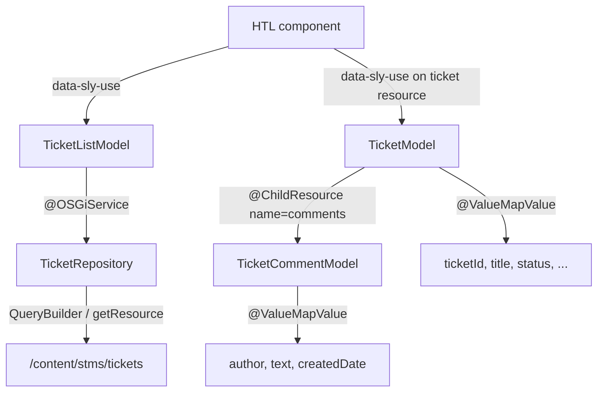

# Support Ticket JCR Schema and Sling Model Architecture

## Design Principles

- **Data nodes, not pages** — Tickets are operational data, not authored pages. Use `nt:unstructured` with a dedicated `sling:resourceType` rather than `cq:Page`.
- **Node name = ticket ID** — Enables direct lookup at `/content/stms/tickets/{ticketId}` without a separate index property (still store `ticketId` for portability and API responses).
- **Comments as ordered child nodes** — Under a `comments` container; each comment is its own subnode (append-only, easy to audit).
- **Closed vocabularies** — `status` and `priority` stored as lowercase kebab-case strings, validated in Java enums.
- **Align with STMS conventions** — Package root [`com.ttn.stms.core`](core/src/main/java/com/ttn/stms/core/), `Resource`-adaptable models (same pattern as [`HelloWorldModel`](core/src/main/java/com/ttn/stms/core/models/HelloWorldModel.java)), tests via [`AppAemContext`](core/src/test/java/com/ttn/stms/core/testcontext/AppAemContext.java).

---

## JCR Node Schema — ASCII Directory Structure

```
/content/stms/tickets                          [sling:Folder | nt:unstructured]
│   jcr:title = "Support Tickets"
│   sling:resourceType = "stms/tickets/folder"
│
├── TICKET-0001                                [nt:unstructured]
│   │   sling:resourceType = "stms/tickets/ticket"
│   │   ticketId       = "TICKET-0001"         (String)
│   │   title          = "Login page returns 500" (String)
│   │   description    = "Users cannot sign in..." (String, plain or HTML)
│   │   status         = "open"                (String enum)
│   │   priority       = "high"                (String enum)
│   │   assignee       = "rahul.pandey@ttn.com" (String — email or /home/users/... path)
│   │   createdDate    = "2026-08-31T10:15:00.000+05:30" (Date, Calendar)
│   │   jcr:created    = (system audit — do not overwrite)
│   │   jcr:lastModified = (system audit)
│   │   jcr:createdBy  = (system audit)
│   │
│   └── comments                                 [nt:unstructured]
│       │   sling:resourceType = "stms/tickets/comments"
│       │
│       ├── comment-20260831-101530-001          [nt:unstructured]
│       │       sling:resourceType = "stms/tickets/comment"
│       │       commentId    = "comment-20260831-101530-001"
│       │       author       = "admin"
│       │       text         = "Reproduced on Chrome 128."
│       │       createdDate  = "2026-08-31T10:15:30.000+05:30"
│       │
│       └── comment-20260831-143000-002          [nt:unstructured]
│               commentId    = "comment-20260831-143000-002"
│               author       = "rahul.pandey@ttn.com"
│               text         = "Assigned to backend team."
│               createdDate  = "2026-08-31T14:30:00.000+05:30"
│
├── TICKET-0002                                [nt:unstructured]
│   │   ticketId = "TICKET-0002"
│   │   status   = "in-progress"
│   │   ...
│   └── comments/
│       └── comment-...
│
└── TICKET-0003                                [nt:unstructured]
    │   status   = "resolved"
    └── comments/
        └── comment-...
```

### Enumerated Property Values

| Property | Allowed Values |
|---|---|
| `status` | `open`, `in-progress`, `resolved`, `closed` |
| `priority` | `low`, `medium`, `high`, `critical` |

### Node Type Summary

| Path segment | `jcr:primaryType` | `sling:resourceType` |
|---|---|---|
| `tickets` | `sling:Folder` | `stms/tickets/folder` |
| `{ticketId}` | `nt:unstructured` | `stms/tickets/ticket` |
| `comments` | `nt:unstructured` | `stms/tickets/comments` |
| `comment-*` | `nt:unstructured` | `stms/tickets/comment` |

### Sample `.content.xml` (one ticket)

Deploy via [`ui.content`](ui.content/) under `jcr_root/content/stms/tickets/`:

```xml
<?xml version="1.0" encoding="UTF-8"?>
<jcr:root xmlns:sling="http://sling.apache.org/jcr/sling/1.0"
          xmlns:jcr="http://www.jcp.org/jcr/1.0"
          jcr:primaryType="sling:Folder"
          jcr:title="Support Tickets"
          sling:resourceType="stms/tickets/folder">
    <TICKET-0001 jcr:primaryType="nt:unstructured"
                 sling:resourceType="stms/tickets/ticket"
                 ticketId="TICKET-0001"
                 title="Login page returns 500"
                 description="Users cannot sign in after deploy."
                 status="open"
                 priority="high"
                 assignee="rahul.pandey@ttn.com"
                 createdDate="{Date}2026-08-31T10:15:00.000+05:30">
        <comments jcr:primaryType="nt:unstructured"
                  sling:resourceType="stms/tickets/comments">
            <comment-20260831-101530-001
                jcr:primaryType="nt:unstructured"
                sling:resourceType="stms/tickets/comment"
                commentId="comment-20260831-101530-001"
                author="admin"
                text="Reproduced on Chrome 128."
                createdDate="{Date}2026-08-31T10:15:30.000+05:30"/>
        </comments>
    </TICKET-0001>
</jcr:root>
```

Also add `/content/stms/tickets` to [`ui.content/.../META-INF/vault/filter.xml`](ui.content/src/main/content/META-INF/vault/filter.xml).

---

## Sling Model Architecture

### Package Layout

```
core/src/main/java/com/ttn/stms/core/tickets/
├── enums/
│   ├── TicketStatus.java          # fromValue("open") → OPEN
│   └── TicketPriority.java        # fromValue("high") → HIGH
├── models/
│   ├── TicketModel.java           # single ticket (Resource-adaptable)
│   ├── TicketCommentModel.java    # single comment child
│   └── TicketListModel.java       # HTL list component model
└── services/
    ├── TicketRepository.java      # OSGi service interface
    └── impl/
        └── TicketRepositoryImpl.java  # @Component DS implementation
```

### Read Flow



### Model Responsibilities

**`TicketModel`** — Adapts a single ticket `Resource`.

```java
@Model(
    adaptables = Resource.class,
    resourceType = TicketModel.RESOURCE_TYPE,
    defaultInjectionStrategy = DefaultInjectionStrategy.OPTIONAL
)
public class TicketModel {
    public static final String RESOURCE_TYPE = "stms/tickets/ticket";

    @ValueMapValue private String ticketId;
    @ValueMapValue private String title;
    @ValueMapValue private String description;
    @ValueMapValue private String status;      // raw JCR value
    @ValueMapValue private String priority;
    @ValueMapValue private String assignee;
    @ValueMapValue private Calendar createdDate;

    @ChildResource(name = "comments")
    private List<TicketCommentModel> comments;

    // Typed getters: getStatusEnum(), getPriorityEnum()
    // getComments() returns unmodifiable list sorted by createdDate
}
```

**`TicketCommentModel`** — Adapts each comment subnode.

```java
@Model(
    adaptables = Resource.class,
    resourceType = TicketCommentModel.RESOURCE_TYPE,
    defaultInjectionStrategy = DefaultInjectionStrategy.OPTIONAL
)
public class TicketCommentModel {
    public static final String RESOURCE_TYPE = "stms/tickets/comment";

    @ValueMapValue private String commentId;
    @ValueMapValue private String author;
    @ValueMapValue private String text;
    @ValueMapValue private Calendar createdDate;
}
```

**`TicketListModel`** — For list/dashboard HTL; delegates querying to OSGi service.

```java
@Model(adaptables = SlingHttpServletRequest.class)
public class TicketListModel {
    @OSGiService private TicketRepository ticketRepository;
    @SlingObject private ResourceResolver resolver;

    @RequestAttribute(name = "status")   // optional filter from request
    private String statusFilter;

    @PostConstruct void init() {
        tickets = ticketRepository.findTickets(resolver, statusFilter, assigneeFilter, limit);
    }
}
```

### OSGi Service Layer

**`TicketRepository`** (interface) — Keeps JCR access out of Sling Models (testable, reusable from servlets/workflows later).

| Method | Purpose |
|---|---|
| `Optional<TicketModel> getTicket(ResourceResolver, String ticketId)` | Direct path lookup |
| `List<TicketModel> findTickets(resolver, status, assignee, limit)` | Filtered listing |
| `List<TicketModel> findAllTickets(resolver)` | Full list (paginated in impl) |

**`TicketRepositoryImpl`** — `@Component(service = TicketRepository.class)` using:
- **Direct read**: `resolver.getResource("/content/stms/tickets/" + ticketId).adaptTo(TicketModel.class)`
- **Filtered list**: AEM `QueryBuilder` with predicates on `sling:resourceType`, `status`, `assignee` under `/content/stms/tickets`

Example query predicates:

```
path=/content/stms/tickets
type=nt:unstructured
property=sling:resourceType
property.value=stms/tickets/ticket
property=status
property.value=open
orderby=@createdDate
orderby.sort=desc
```

### HTL Usage Patterns

**Single ticket** (resource-bound component):

```html
<div data-sly-use.ticket="com.ttn.stms.core.tickets.models.TicketModel">
  <h2>${ticket.title}</h2>
  <p>Status: ${ticket.statusEnum.label}</p>
  <ul data-sly-list.comment="${ticket.comments}">
    <li>${comment.author}: ${comment.text}</li>
  </ul>
</div>
```

**Ticket list** (dedicated list component):

```html
<div data-sly-use.list="com.ttn.stms.core.tickets.models.TicketListModel">
  <div data-sly-repeat.ticket="${list.tickets}">
    ${ticket.ticketId} — ${ticket.title} (${ticket.status})
  </div>
</div>
```

---

## Oak Index (Cloud Service — follow-up)

No custom Oak indexes exist in the project today. Once ticket volume grows, add an index under `ui.config` for efficient filtering:

```
/oak:index/stms-ticket-index
  - sling:resourceType (propertyIndex)
  - status (propertyIndex)
  - assignee (propertyIndex)
  - createdDate (orderedIndex)
```

Required for performant `findTickets()` queries at scale on AEM Cloud.

---

## Test Strategy

Mirror existing [`HelloWorldModelTest`](core/src/test/java/com/ttn/stms/core/models/HelloWorldModelTest.java) patterns:

- **`TicketModelTest`** — `AppAemContext` creates ticket + comment nodes; assert property mapping and comment list size.
- **`TicketRepositoryImplTest`** — Seed multiple tickets; assert `findTickets(resolver, "open", null, 10)` returns expected count.
- **`TicketStatusTest`** — Unit test enum `fromValue()` rejects invalid JCR values gracefully.

---

## Files to Create (implementation phase)

| Module | Files |
|---|---|
| `ui.content` | `content/stms/tickets/.content.xml` (seed data), update `filter.xml` |
| `core` | `tickets/enums/*`, `tickets/models/*`, `tickets/services/*` |
| `core` (test) | `tickets/models/TicketModelTest.java`, `tickets/services/TicketRepositoryImplTest.java` |
| `ui.apps` (later) | `ticket-detail` and `ticket-list` HTL components bound to resource types |

This design keeps ticket data cleanly separated from the site page tree (`/content/stms/us/en`), supports dynamic reads via Sling Models + OSGi repository, and scales to servlets, workflows, or headless APIs without schema changes.
